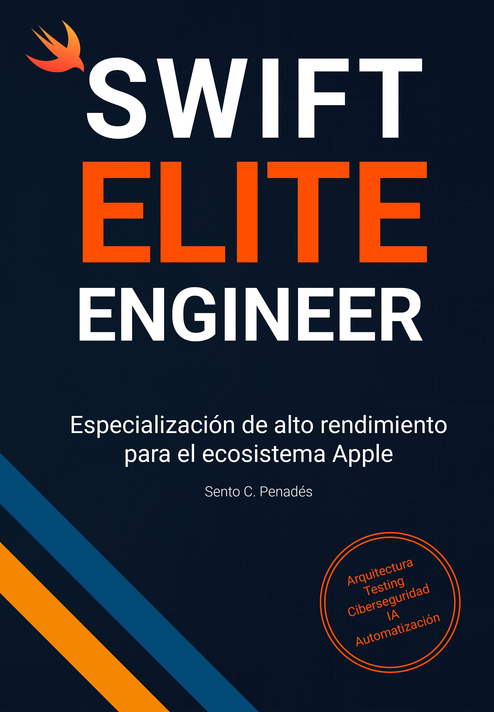

# SWIFT ELITE ENGINEER

[🇬🇧 Read this in English →](../README.md)


---

## ✨ Bienvenido a Swift Elite Engineer

Este repositorio contiene **proyectos completos y listos para producción** basados en los capítulos del libro:

# **Swift Elite Engineer**  
### *Especialización de alto rendimiento para el ecosistema Apple*

Por **Sento C. Penadés**

<a href="https://www.amazon.com/dp/B0D2FYR9C3" target="_blank">
  
</a>

---

## 📚 Sobre el libro

**Swift Elite Engineer** es una guía extensa y práctica para profesionales que quieren llevar sus habilidades en Swift al siguiente nivel. Este libro es tu acceso directo a las **mejores prácticas de desarrollo Swift** para **iOS, iPadOS, macOS, tvOS, watchOS, VisionOS**, cubriendo desde los cimientos de arquitectura avanzada hasta las estrategias más sofisticadas de automatización y testing.

**Aprende a evitar los errores más comunes** y optimizar tu proceso de trabajo con tecnología de vanguardia.

Con más de **11 años de experiencia liderando equipos de alto rendimiento**, no solo te enseño código, te muestro cómo construir **aplicaciones robustas, seguras y con un rendimiento imparable**.

La **inteligencia artificial, la ciberseguridad y la automatización** de tus flujos de trabajo están a tu alcance para transformar por completo tu forma de desarrollar.

Si aspiras a **dominar por completo el desarrollo de software del ecosistema Apple**, este libro es tu guía para lograrlo.

> **¡Desata tu potencial!  
> ¡Marca la diferencia en cada proyecto!**

---

### Qué vas a encontrar en este libro

1. **Desata tu potencial: Nivel leyenda**
2. **La brújula que te guía**
3. **Errores típicos en tus proyectos (y cómo evitarlos)**
4. **Cimientos de clase mundial**
5. **Testing a prueba de balas**
6. **Superpoder: Automatiza y optimiza**
7. **La fórmula secreta para Apps inmortales**
8. **Hackeado en**


## 💻 Ya disponible en:

- 📘 Edición en papel (en español)  
[Consíguelo en Amazon →](https://www.amazon.es/dp/8409733153)

**Ediciones digital y en inglés muy pronto.**

---

## 🤖 ¿Qué incluye este repositorio?

Este repositorio contiene ejemplos completos para todos los capítulos clave del libro:

- Sourcery aplicado a casos reales
- Automatización con Fastlane Swift
- Modularización con XcodeGen y XCConfig
- Feature Flags (estáticas y dinámicas)
- Principios SOLID en Swift
- Refactorización de un AppDelegate gigante
- Arquitectura CLEAN desde cero
- Testing avanzado con Swift
- …¡y mucho más!

---

## 👨‍💻 ¿Para quién es esto?

Este libro y repositorio se enfocan en el desarrollo Swift para:

- Diseñar como un senior desde el día uno
- Mejorar la arquitectura y calidad de su código
- Automatizar el flujo de trabajo con herramientas reales
- Aprender haciendo, con ejemplos concretos y funcionales

Si te tomas en serio tu carrera como Apple Engineer, este es tu camino.

---

## ⚖️ Licencia

```
Copyright (C) 2025 Sento C. Penadés - Todos los derechos reservados

La copia o redistribución no autorizada de este archivo en cualquier forma, fuente o binaria, está estrictamente prohibida.
```