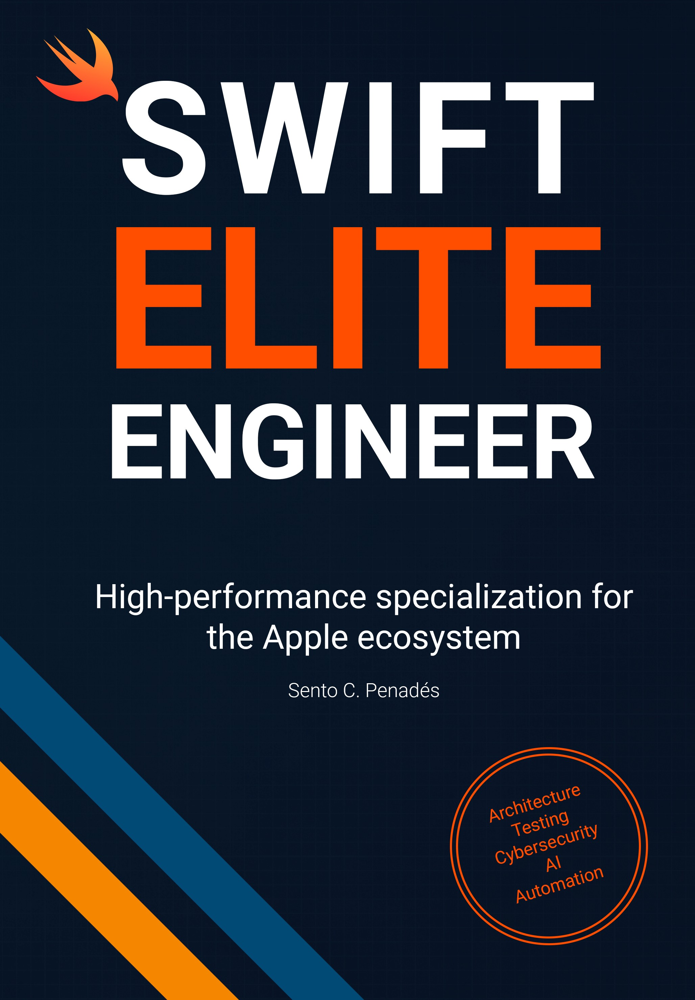

# SWIFT ELITE ENGINEER

[🇪🇸 Lee esto en español →](./Docs/Readme-es.md)


---

## ✨ Welcome to Swift Elite Engineer

This repository includes **production-ready code samples** and **complete chapter projects** from the book:

# **Swift Elite Engineer**  
### *High-performance specialization for the Apple ecosystem*

By **Sento C. Penadés**

<a href="https://www.amazon.com/dp/B0D2FYR9C3" target="_blank">
  
</a>

---

## 📚 About the Book

**Swift Elite Engineer** is a deep, hands-on guide for professionals ready to take their Swift skills to the next level. This book is your direct access to **best practices in Swift development** for **iOS, iPadOS, macOS, tvOS, watchOS, VisionOS**, and more—covering everything from the foundations of advanced architecture to the most sophisticated automation and testing strategies.

**Learn how to avoid the most common mistakes** and optimize your workflow with cutting-edge technology.

With over **11 years of experience leading high-performance teams**, I won’t just teach you code, I’ll show you how to build **robust, secure apps with unstoppable performance**.

**Artificial Intelligence, Cybersecurity, and Workflow Automation** are now within your reach to completely transform the way you develop.

If your goal is to **fully master Apple ecosystem software development**, this book is your guide to achieving it.

> **Unleash your potential!  
> Make a difference in every project!**

---

### What You’ll Find in This Book

1. **Unleash Your Potential: Legend Level**
2. **The Compass That Guides You**
3. **Typical Mistakes in Your Projects (and How to Avoid Them)**
4. **World-Class Foundations**
5. **Bulletproof Testing**
6. **Superpower: Automate and Optimize**
7. **The Secret Formula for Immortal Apps**
8. **Hacked in 3, 2, 1… Cybersecurity**
9. **Artificial Intelligence #1**
10. **The Other 50%: Soft Skills**
11. **The Grand Finale**
12. **Offboarding**

---

I’ve trained dozens of developers who now lead technical teams at top-tier companies.  
This book captures **everything I wish I had known when I was starting out**.

It’s not just a book—  
it’s a **hands-on guide to becoming a legend**.


## 💻 Available now in:

- 📘 Paperback (Spanish edition)  
[Buy it on Amazon →](https://www.amazon.es/dp/8409733153)

**English & Digital Editions coming soon!**

---

## 🤖 What's in this Repo?

This repository includes code samples and complete implementations for each major chapter:

- Sourcery in real-world use cases
- Fastlane Swift workflows
- XcodeGen + modular XCConfig setup
- Feature Flags (Static & Dynamic)
- SOLID Principles in Swift
- Refactoring a Massive AppDelegate
- Clean Architecture from scratch
- Advanced Swift Testing
- …and more!

---

## 👨‍💻 Who Is This For?

This project is for Swift developers who:

- Want to build apps like a senior engineer from day one
- Seek to improve code architecture and maintainability
- Value automation, clarity, and clean design
- Learn best by doing—with full code examples

If you're serious about mastering Swift at a professional level, this is your roadmap.

---

## ⚖️ License

```
Copyright (C) 2025 Sento C. Penadés - All Rights Reserved 

Unauthorized copying or redistribution of this file in source and binary forms via any medium 
is strictly prohibited.
```